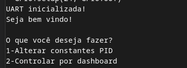
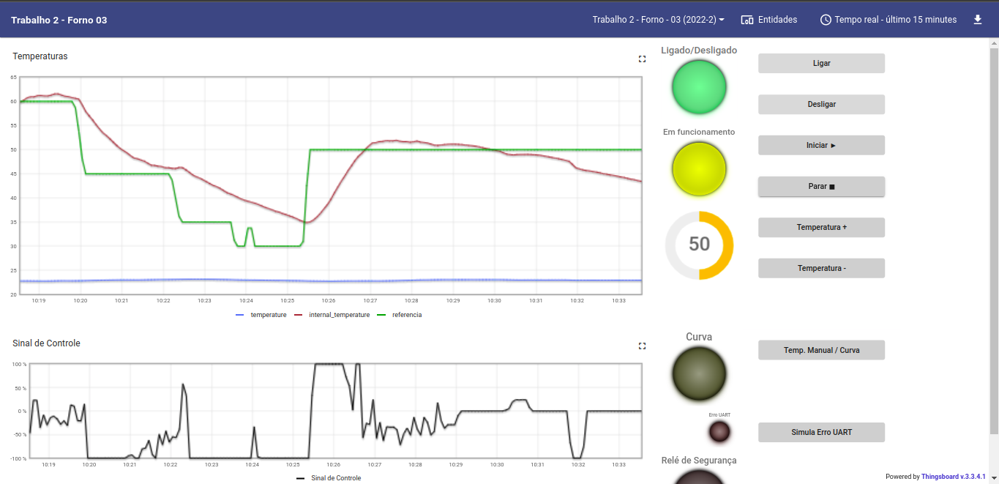
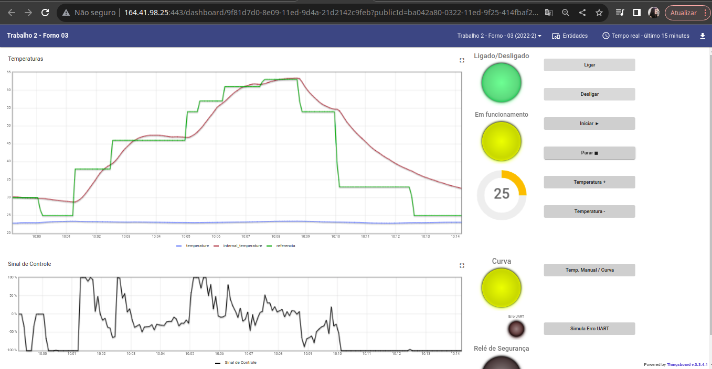
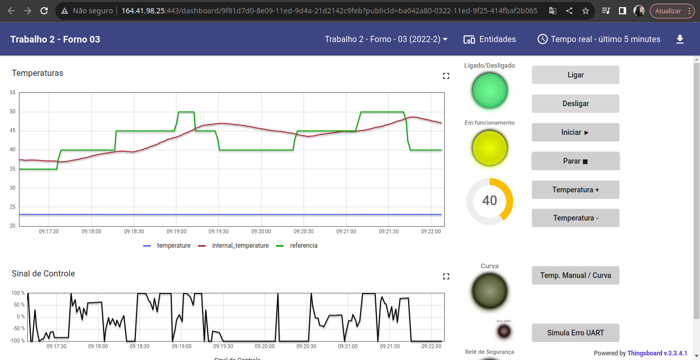

# Trabalho 2 - Fundamentos de Sistemas Embarcados

Nome: Dafne Moretti Moreira

Matrícula: 190026243

Neste repositório consta o código do [trabalho 2](https://gitlab.com/fse_fga/trabalhos-2022_2/trabalho-2-2022-2) que consiste em um software de sistema embarcado que controla a temperatura de um forno utilizando dois atuadores: um resistor e uma ventoinha.

## Dependências

Para rodar o projeto, você precisa ter o **python** instalado na sua máquina

ALém disso, é necessária a instalação das dependências abaixo.

```bash
pip install RPi.GPIO
```

Versão 0.2.4 da RPi.bme280:

```bash
pip install RPi.bme280
```

Versão 0.6 da bme280:

```bash
pip install bme280
```

Versão 0.4.2 do smbus2:

```bash
pip install smbus2
```

## Rodar

Após a instalação das dependências, basta entrar na pasta src

```bash
cd src
```

E por fim, rodar o comando abaixo:

```bash
python main.py
```

## Terminal

No terminal o usuário pode, além de iniciar o sistema, definir diferentes valores para as constantes do PID (Kp, Ki e Kd).



## Dashboard

Na dashboard o usuário pode

- Ligar o forno
- Desligar o forno
- Iniciar aquecimento
- Parar aquecimento
- Trocar modo de temperatura



## Gráficos

Para cada experimento, foram gerados dois gráficos. Um com as temperaturas (ambiente, interna e referência) e um com o sinal de controle.

Para o experimento do modo curva, onde é lido um arquivo csv com os tempos e as temperaturas de referência desejadas, foram gerados os seguintes gráficos:



Para o experimento do modo usuário, o usuário que define a temperatura de referência que deverá ser utilizada e por isso, os gráficos gerados foram:


